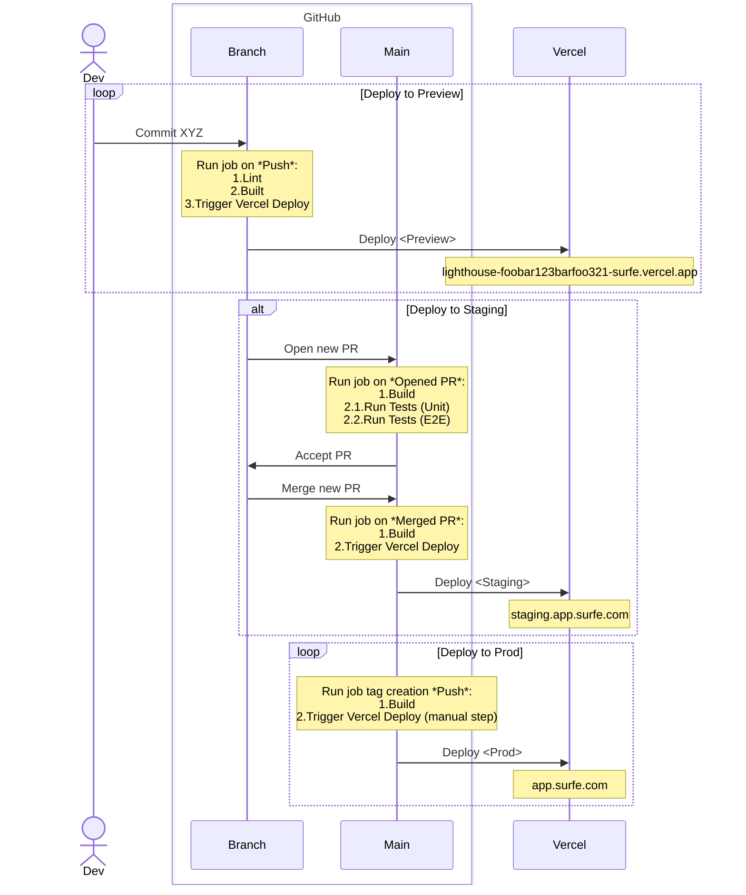

# github-actions-vercel
> A simple PoC demonstrating Trunk Based CI/CD workflow, using GitHub actions and Vercel.

## Status

## Environments

## Workflow

```mermaid
sequenceDiagram
    actor D as Dev
    participant B as Branch
    participant M as Main
    participant V as Vercel

    box GitHub
        participant B
        participant M
    end

    loop Deploy to Preview
        D->>B: Commit XYZ
        Note over B: Run job on *Push*:<br>1.Lint<br>2.Built<br>3.Trigger Vercel Deploy
        B->>V: Deploy <Preview>
        Note over V: lighthouse-foobar123barfoo321-surfe.vercel.app
    end

    alt Deploy to Staging
        B->>M: Open new PR
        Note over M: Run job on *Opened PR*:<br>1.Build<br>2.1.Run Tests (Unit)<br>2.2.Run Tests (E2E)
        M->>B: Accept PR
        B->>M: Merge new PR
        Note over M: Run job on *Merged PR*:<br>1.Build<br>2.Trigger Vercel Deploy
        M->>V: Deploy <Staging>
        Note over V: staging.app.surfe.com
    end

    loop Deploy to Prod

        Note over M: Run job tag creation *Push*:<br>1.Build<br>2.Trigger Vercel Deploy (manual step)
        M->>V: Deploy <Prod>
        Note over V: app.surfe.com
    end
```