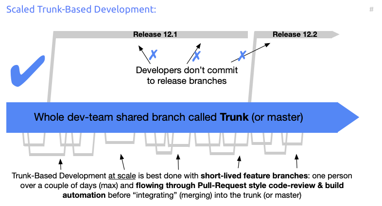
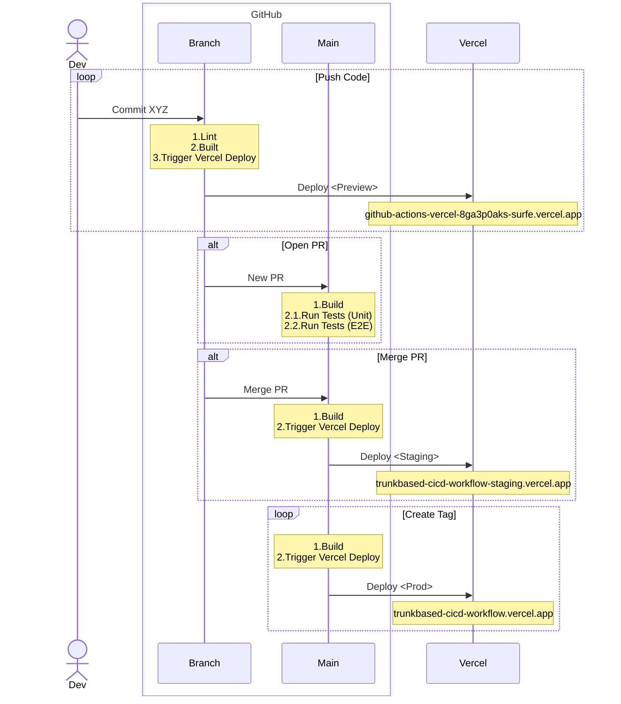
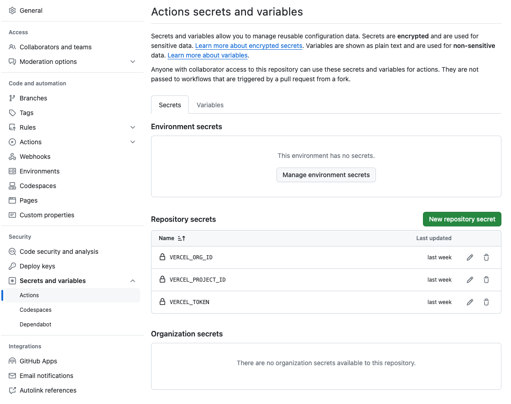

# github-actions-vercel
> A simple PoC demonstrating Trunk Based CI/CD workflow, using GitHub actions and Vercel.

### Environments

## Overview

### Trunk Based Workflow for Fast CI/CD

Refreshed on Trunk Based workflow ([read more here](https://trunkbaseddevelopment.com/)).

### Workflow Concepts

1. A Workflow is what GitHub calls Action(s)
2. Actions can have one or more Jobs, with one or more Steps
3. Workflows are created under `.github/workflows` (GitHub treats any yml file under `workflows` as an Action to be executed)
4. File name follows a pattern to loosely indicate the trigger method `on_<trigger-method>.yml`

### How it works

1. Dev _commits code_ to any branch (no open PR yet) -> Execute Linting job and deploys a preview URL to Vercel
2. PR is _opened_ into `main` branch -> Execute Test jobs
3. PR is _merged_ into `main` branch -> Project deployed to Staging env
4. Tag is _created_ from `main` branch -> Project deployed to Production env

### PoC Under the Hood

- Project is a simple static site with 2 pages
- Server is ran using [PM2](https://www.npmjs.com/package/pm2), which allows to run it in the background without blocking execution of job steps
- Interfacing with Vercel is done using their [CLI](https://vercel.com/docs/cli)
- Vercel project and org keys must be setup for using the CLI (see below)

### Setting up Secrets

In this case, secrets were setup at the level of Actions (but can be set at the repo level and/or per environment):

